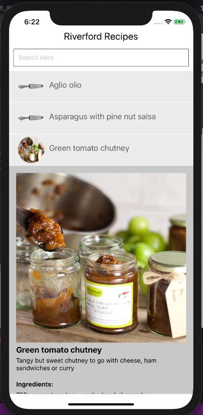
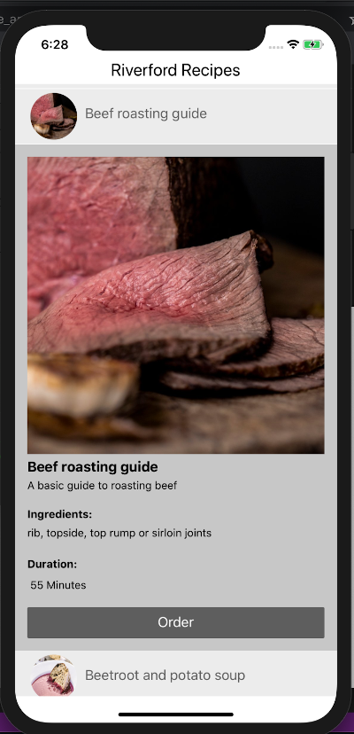
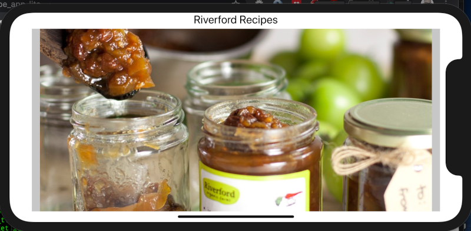

### General

Time taken: Probably in total about 1 - 2 days. It took me longer to set up environments/ pipelines. Some wrong turns. Unnecassary complications. I feel I am rusty having not been commercially coding for almost 6 months!. Am unfamiliar with some techniques and the database schema. And working 5 days a week on the Recipe line! :metal:    

IOS/Android: Only tested on IOS

Haven't tested memory usage on devices

### Notes

This is a 'lite' version. I tried to use Material UI that I used last year in ReactJs but struggled with linking the Icons in XCode. Somehow I got it working on my original devlopment version, but then couldn't get it to work when transferring files and rebuilding in github production folder. I need to do more investigating into how XCode works with React Native and icons/ fonts. 
Have left in the commented out problem code: Recipe.js l15,16, 145, 168

```react-native-vector-icons``` is the issue!

It may be better for memory/ compiling on different platforms. etc..? to just use React Native 'core' ?

GraphQL - Did an 'old-fashioned' technique of getting ALL data and then querying the object locally, which could be good if internet intermittent? But I think a better, more modern technique would be to use the GraphQL query language on the server. I did get Apollo working with the GraphQL libraries but then went with 'fetch' because I am more familiar with it.

### Future Developments
It would be interesting to take the ingredients and see if it was possible to get the actual corresponding stock details from the database. Would then potentially have a really useful app on my phone in morning when trying to load the line!

Would also be interesting to develop a fully functioning, customer-facing recipe app. With videos, other info, ordering system, etc.

### Dependencies
- react-native
- graphql

### Screenshots




