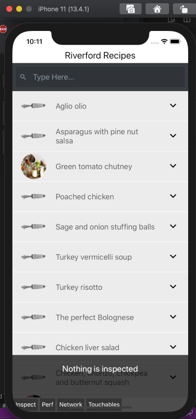
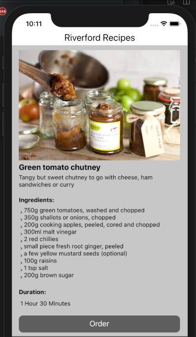
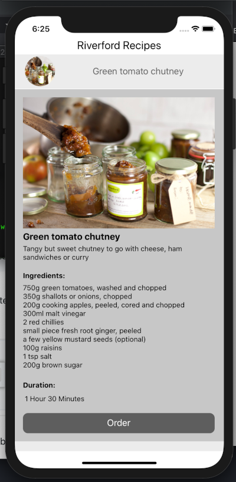

### General

Time taken: Probably in total about a day. It took me longer to set up environments. Some wrong turns. Uneccasry complications. I feel I am rusty having not been commercially coding for almost 6 months. And unfamiliar with some techniques and the database schema.

IOS/Android: Only tested on IOS

Landscape/Portrait: Need more work doing oin bigger full screen landscape

### Notes:

This is a 'lite' version. I tried to use Material UI that I used last year in RactJs but struggled with linking the Icons in XCode. Somehow I got it working on my original version, but then couldn't get it to work when transferring file to production folder. I need to do more investigating into how XCode works with React Native and icons. Have left in the commented out problem code.

```npm install react-native-vector-icons```

GraphQL - Did an 'old-fashioned' technique of getting ALL data and querying the object locally. I think a better, more modern, technique would be to use the GraphQL query language. More learning required. This would affect memory at runtime?

### Future Developments
It would be interesting to take the ingredients and see if it was possible to get the actual corresponding stock details from the database. Would then potentially have a really useful app on my phone in morning when trying to load the line!

### Dependencies
- react-native
- graphql

### Screenshots



